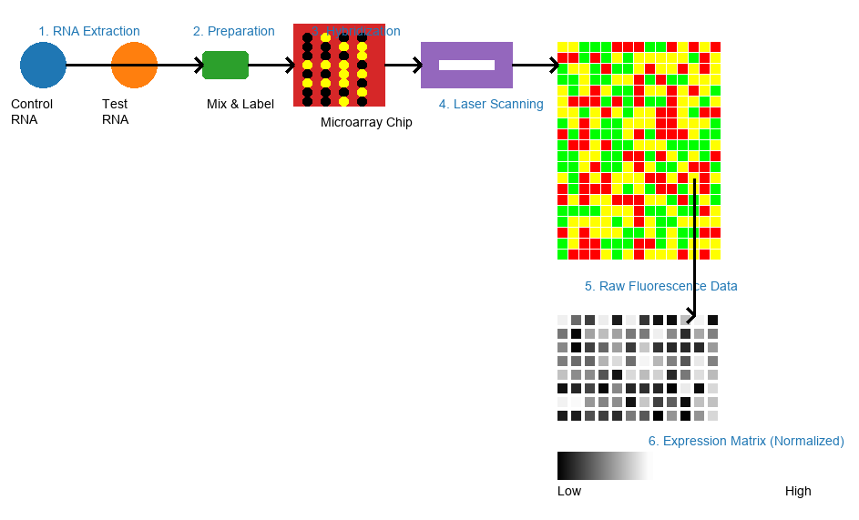

# Microarray Gene Expression Datasets

This repository contains a curated collection of published microarray gene expression datasets used in support of our research article titled: "[An Integrated Approach for Key Gene Selection and Cancer Phenotype Classification: Improving Diagnosis and Prediction](https://doi.org/10.1016/j.compbiomed.2025.110687)" 

This article has been accepted for publication in the journal [Computers in Biology and Medicine](https://www.sciencedirect.com/journal/computers-in-biology-and-medicine) 

All datasets have been analyzed using the [HMCC](https://github.com/BandhanSarker/HMCC) R package as part of our research workflow.

## Datasets
The table below summarizes the currently available microarray gene expression datasets included in this repository.
They are loosely ordered based on dataset complexity, such as the number of experimental conditions or phenotype classes.

| Dataset | Description | Root repository | Reference |
| --- | --- | --- | --- |
| [Leukemia](https://github.com/BandhanSarker/Microarray_gene_expression_datasets/blob/main/MicroarrayData/Leukemia.rds) | The leukemia dataset contains 7129 genes with 72 samples. It has two classes, 47 acute lymphoblastic leukemia (ALL) and 25 acute myeloid leukemia (AML) samples | [Data](https://csse.szu.edu.cn/staff/zhuzx/Leukemia.zip) | [DOI](https://doi.org/10.1126/science.286.5439.531) |
| [Colon](https://github.com/BandhanSarker/Microarray_gene_expression_datasets/blob/main/MicroarrayData/Colon.rds) | The colon dataset contains 2000 genes with 62 samples (40 cancers and 22 controls) | [Data](https://csse.szu.edu.cn/staff/zhuzx/Colon.zip) | [DOI](https://doi.org/10.1073/pnas.96.12.6745) |
| [Prostate](https://github.com/BandhanSarker/Microarray_gene_expression_datasets/blob/main/MicroarrayData/Prostate.rds) | The prostate dataset contains 12600 genes with 102 samples (52 cancers and 50 controls) | [Data](https://file.biolab.si/biolab/supp/bi-cancer/projections/info/prostata.html) | [DOI](https://doi.org/10.1016/s1535-6108(02)00030-2) |
| [DLBCL](https://github.com/BandhanSarker/Microarray_gene_expression_datasets/blob/main/MicroarrayData/DLBCL.rds) | DLBCL dataset contains 7129 genes with 77 samples. It has two classes, 58 diffuse large B-cell lymphomas (DLBCL) and 19 follicular lymphoma (FL) samples | [Data](https://file.biolab.si/biolab/supp/bi-cancer/projections/info/DLBCL.html) | [DOI](https://doi.org/10.1038/nm0102-68) |
| [MLL](https://github.com/BandhanSarker/Microarray_gene_expression_datasets/blob/main/MicroarrayData/MLL.rds) | MLL dataset contains 12582 genes and 72 samples with three classes. Among them 24 samples are acute lymphoblastic leukemia (ALL), 28 samples are acute myeloid leukemia (AML), and 20 samples are mixed-lineage leukemia gene (MLL) | [Data](https://csse.szu.edu.cn/staff/zhuzx/MLL.zip) | [DOI](https://doi.org/10.1038/ng765) |
| [GLIOMA](https://github.com/BandhanSarker/Microarray_gene_expression_datasets/blob/main/MicroarrayData/Glioma.rds) | GLIOMA dataset contains 12625 genes and 50 samples which have four classes. Among them 14 samples are cancer glioblastomas (CG), 14 samples are non-cancer glioblastomas (NG), 7 samples are cancer oligodendrogliomas (CO) and 15 samples are non-cancer oligodendrogliomas (NO) | [Data](https://file.biolab.si/biolab/supp/bi-cancer/projections/info/glioblastoma.html) | [DOI](https://pubmed.ncbi.nlm.nih.gov/12670911/) |
| [SRBCT](https://github.com/BandhanSarker/Microarray_gene_expression_datasets/blob/main/MicroarrayData/SRBCT.rds) | SRBCT dataset contains 2308 genes with 83 samples in four classes, namely Ewing family of tumors (EWS) has 29 samples, Burkitt lymphoma (BL) has 11 samples, neuroblastoma (NB) have 18 samples and rhabdomyosarcoma (RMS) have 25 samples | [Data](https://csse.szu.edu.cn/staff/zhuzx/SRBCT.zip) | [DOI](https://doi.org/10.1038/89044) |
| [Lung](https://github.com/BandhanSarker/Microarray_gene_expression_datasets/blob/main/MicroarrayData/Lung.rds) | The lung dataset has 12600 genes and 203 samples. Samples are subdivided into five classes, such as adenocarcinomas (ad) has 139 samples, squamous cell lung carcinomas (sqclc) hashas 21 samples, pulmonary carcinoids (pc) has 20 samples, small-cell lung carcinomas (sclc) has 6 samples and normal lung (NL) has 17 samples | [Data](https://file.biolab.si/biolab/supp/bi-cancer/projections/info/lung.html) | [DOI](https://doi.org/10.1073/pnas.191502998) |
| [Bladder](https://github.com/BandhanSarker/Microarray_gene_expression_datasets/blob/main/MicroarrayData/Bladder_GSE7476.rds) | Bladder cancer microarray dataset comprising 3 normal and 9 tumor samples with 54675 Probe IDs | [Data](https://www.ncbi.nlm.nih.gov/geo/query/acc.cgi?acc=GSE7476) | [DOI](https://doi.org/10.1016/j.juro.2009.03.084) |

